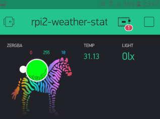
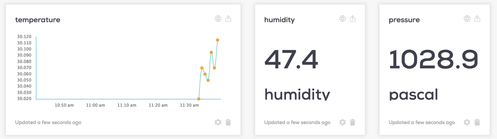

# iot-edge-stepping-stones

Collection of IoT solutions and ideas (MQTT, GATT, BLE, BT, PI, SENSORS, PLATFORMS) for connected devices.

Technologies
=============
* BLE advertising
* MQTT Broker

Edge platforms
==============
* EdgeXfoundry

IoT Clouds
===========
* WiA
* ThingSpeak
* Blynk

Boards
======
* BME680 module
* Sensornode MCU
* Pi-SenseHat
* Raspberry Pi

.. image:: ./thingspeak/pics/thingspeak-dash.png
   :scale: 25 %
   :alt: ThingSpeak weather station dashboard

.. image:: ./thingspeak/pics/thingspeak-twitter.png
   :scale: 25 %
   :alt: ThingSpeak twitter integrqation

Credits
=======
- Dr Frank Walsh, CS, Waterford Institute of Technology, inspired this.
