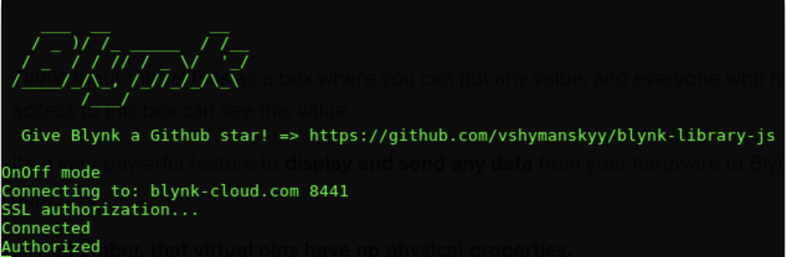
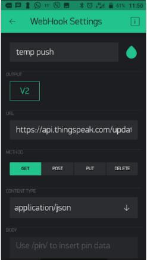
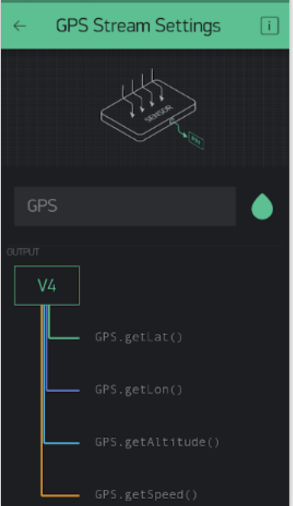

Use Blynk Mobile App to control, collect, and analyize your devices.

Software, Hardware
===================
* Blynk app on Android or IoS
* Raspberry Pi2B/Pi3B / Node Blynk library
* Access tokens as OS environment variables

IoT Platform
============

https://www.blynk.cc/

OS setup
========

* Setup iot platform access tokens how you like. I use `~/.bash_profile` to manage as environment variables. Remember `sudo -E` for scripts needing elevated privledges.

.. code-block:: bash

    vi ~/.bash_profile
    ### My IoT Device Inventory
    export BLYNK_TOKEN_SENSEHAT="xxxxxxxxxxxxxxxxxxxxxxxxxxxxx"
    export BLYNK_TOKEN_RPI3BPLUS=""

    ### environment variables needed by iot-pi-stepping-stones ###
    export MY_BLYNK_TOKEN="${BLYNK_TOKEN_SENSEHAT}"

* Run script to setup each device (subdir containing code)

.. code-block:: bash

    ./configure_node.py

Raspberry Pi virtual pin
========================

Use Blynk to control your device using a Virtual Pin.

* Setup nodejs dependencies:

.. code-block:: bash

    ./configure_blynk.py pi/2b/index.js

* Start nodejs service on-device:

.. code-block:: bash

    sudo -E node ./pi/2b/index.js

* You should see output like the following:

* Go to BlynkApp and Interact with your device using this virtual pin.

Phone Sensors Blynk App
=======================
Blynk app can access phones sensors such as light, and accelerometer.

* In BlynkApp add a "Light Sensor" widget, output to V3, to measure light intensity (lux).

* kill the running node app:

.. code-block:: bash

    Ctrl+C

* Setup nodejs dependencies:

.. code-block:: bash

    ./configure_blynk.py sensehat/2vpin

* Run the node app again:

.. code-block:: bash

    sudo -E node ./sensehat/2vpin/index.js

* Your RPi could perhaps display "too bright/dark" messages on the console depending on what threshold lux value triggers on/off behaviour.

Send data to Thingspeak
=======================
BlynkApp Webhook widget can communicate with 3rd party services like ThingSpeak.

* Go to ThingSpeak.com and create new temperature channel.

* Go to BlynkApp and add "Webhook" from the widget box.

* Monitor V2 and send data to Thingspeak (see: https://docs.blynk.cc/#widgets-other-webhook):

* Kill the running NodeJs service.

.. code-block:: bash

    Ctrl+C

* Setup nodejs dependencies:

.. code-block:: bash

    ./configure_blynk.py sensehat/3vpin

* Run node app again:

.. code-block:: bash

    sudo -E node ./sensehat/3vpin/index.js

Send GPS data to WiA
=====================
BlynkApp Webhook widget can communicate with 3rd party services like WIA.

* Go to BlynkApp and add "GPS Webhook" from widget box:

* Monitor V4 as illustrated.

* Ensure your WiA tokens are OS environ variables:

.. code-block:: bash

    vi ~/.bash_profile
    ### My IoT Device Inventory
    export WIA_TOKEN_SENSEHAT="d_sk_xxxxxxxxxxxxxxxxxxxxxxxpi"
    export WIA_TOKEN_RPI3BPLUS="d_sk_yyyyyyyyyyyyyyyyyyyyyyyy"
    export MY_WIA_TOKEN="${WIA_TOKEN_SENSEHAT}"

    ### environment variables needed by iot-pi-stepping-stones ###
    export MY_WIA_TOKEN="${WIA_TOKEN_SENSEHAT}"

* On your device kill the running NodeJs service.

.. code-block:: bash

    Ctrl+C

* Setup nodejs dependencies:

.. code-block:: bash

    ./configure_blynk.py sensehat/4vpin

* Run node app again:

.. code-block:: bash

    sudo -E node ./sensehat/4vpin/index.js

* Go to wia.io and interact with the service.
