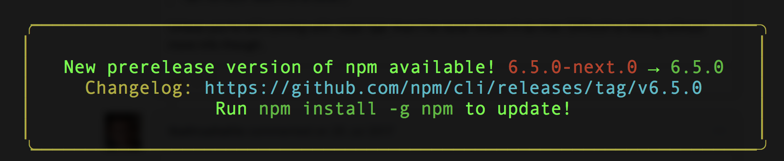

Use Blynk Mobile App to control, collect, and analyize your devices.

Software, Hardware
===================
* Blynk app on Android or IoS
* Raspberry Pi2B/Pi3B / Node Blynk library
* Access tokens as OS environment variables

IoT Platform
============

https://www.blynk.cc/

OS setup
========

* Setup your iot platform access tokens how you like. This example uses `~/.bash_profile` to manage as environment variables. Remember to use `sudo -E` for scripts needing elevated privledges.

.. code-block:: bash

    vi ~/.bash_profile
    ### My IoT Device Inventory
    export BLYNK_TOKEN_SENSEHAT="xxxxxxxxxxxxxxxxxxxxxxxxxxxxx"
    export BLYNK_TOKEN_RPI3BPLUS=""

    ### environment variables needed by iot-pi-stepping-stones ###
    export MY_BLYNK_TOKEN="${BLYNK_TOKEN_SENSEHAT}"

* Create a subdirectory to represent your device-

.. code-block:: bash

    mkdir rpi2b

* Run the script You should see the following output:

.. code-block:: bash

    ./configure_blynk.py -d rpi2b

Simple Blynk App
=================
Use Blynk to control your device using a Virtual Pin.

* Start your on-device Blynk NodeJs service-

.. code-block:: bash

    node ./rpi2b/index.js

* You should see output like the following-

.. image:: ./pics/blynk-ready.png
   :scale: 10 %
   :alt: npm package installed

* Interact with the device from your Blynk app (Android/iOS).

SenseHat Blynk App
==================

* Kill the previous NodeJs service.

.. code-block:: bash

    Ctrl+C

* Start your on-device Blynk NodeJs service for SenseHat-

.. code-block:: bash

    node ./sensehat/index.js

* The service "listens" for reads events on virtual pin V1, and returns SenseHAT temperature to virtual pin V2. Interact with the device from your Blynk app (Android/iOS).

Phone Sensors Blynk App
=======================

* Kill the previous NodeJs service.

.. code-block:: bash

    Ctrl+C

