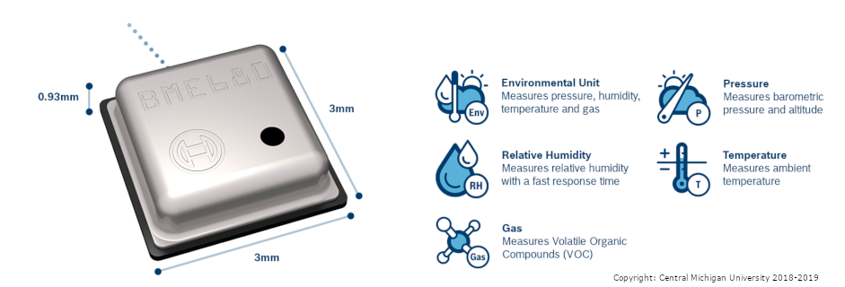

The BME680 digital chip can sense temperature, humidity, barometric pressure, and VOC (Volatile Organic Compounds) gas. Its low power, 8 pin, communicating over I2C (default) or SPI.

Software, Hardware
===================
* Raspberry Pi2B+/3B+
* Four Jumper wires
* BME608 (https://ae-bst.resource.bosch.com/media/_tech/media/datasheets/BST-BME680-DS001-00.pdf)

IoT Platform
============

