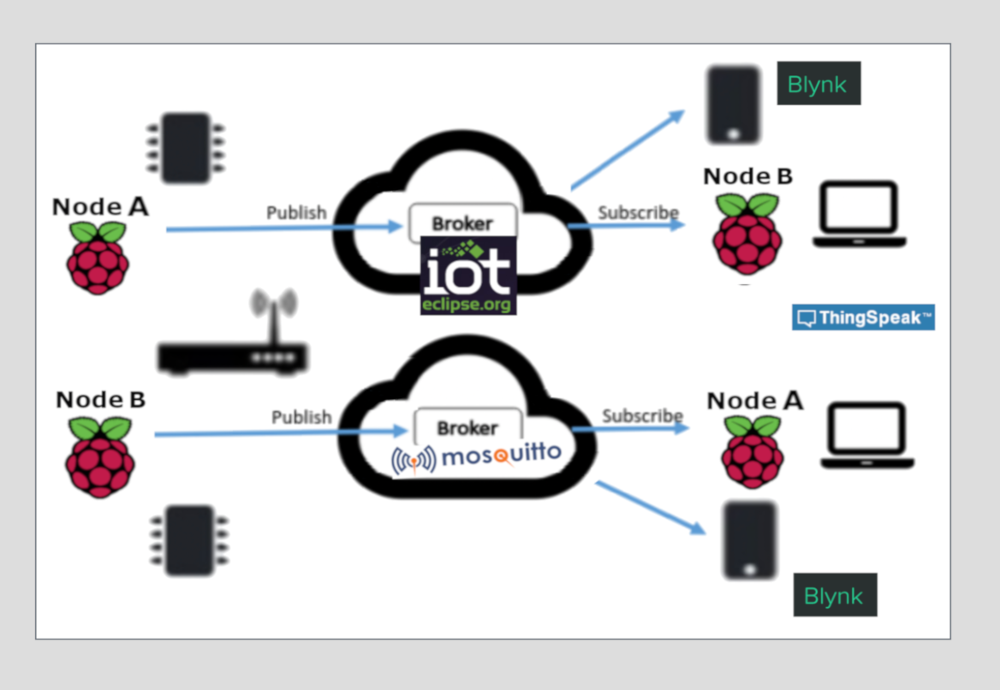

# MQTT for IoT Edge

One great solution for monitoring the IoT Edge is MQTT. It's a flexible 'publish/subscribe/broker' technology which perfectly suited for the internet of things, and transferring data from Edge networks to the cloud.

This article describes a simple redundant Weather-Station solution based on MQTT. Using python I built a small flexible 'mqtt library' to drive this example - the code is available on github - here we go.

Let's build the weather station modeled in this grapic!!

Sample software &Hardware
===========================
* Raspberry Pi2B+ with Environmental Board (i.e. Sense HAT)
* Raspberry Pi3B+ with Environmental Board (i.e. BME680)
* Cloud MQTT Brokers
* TinyDB

Cloud MQTT broker
=================
Pick your cloud mqtt broker, we need this later on.-

* mqtt://iot.eclipse.org:1883
* mqtt://broker.hivemq.com:1883
* mqtt://test.mosquitto.org:1883
* https://www.cloudmqtt.com/

Setup software
=================

* Clone my repo.

.. code-block:: bash

    git clone https://github.com/noelmcloughlin/iot-edge-stepping-stones.git
    cd iot-edge-stepping-stones

* Execute command to setup required software

.. code-block:: bash

        ./mqtt/mqtt.py -a install

Weather Station Site/Zone A
===========================

* On hostA ('sense_hat' board), publish weather data to a cloud MQTT broker:

.. code-block:: bash

    sudo ./mqtt.py -a publish -u mqtt://iot.eclipse.org:1883/NOELWEATHER_A
    Connected to iot.eclipse.org:1883/NOELWEATHER_A Result: 0
    {'h': 49.61815643310547, 't': 29.33, 'p': 1043.434326171875}
    {'h': 49.139583587646484, 't': 29.33, 'p': 1043.46826171875}

* On hostB, subscribe to the weather messages:

.. code-block:: bash

    ./mqtt.py -a subscribe -u mqtt://iot.eclipse.org:1883/NOELWEATHER_A
    Connected to iot.eclipse.org:1883/NOELWEATHER_A Result: 0
    topic:NOELWEATHER_A/h, val:48.9634399414
    topic:NOELWEATHER_A/t, val:29.42
    topic:NOELWEATHER_A/p, val:1043.48852539

* Persist data (to TinyDB) passing '--persist True' flag.

.. code-block:: bash

    sudo ./mqtt.py -a subscribe -u mqtt://iot.eclipse.org:1883/NOELWEATHER_A --persist True
    Connected to iot.eclipse.org:1883/NOELWEATHER_A Result: 0
    Insert DB: NOELWEATHER_A/h, val:48.7972717285
    Insert DB: NOELWEATHER_A/t, val:29.31
    Insert DB: NOELWEATHER_A/p, val:1043.44677734

Weather Station Site/Zone A
===========================

* On hostB ('BME680' board), publish weather data to a different cloud MQTT broker:

.. code-block:: bash

    ./mqtt.py -a publish -u mqtt://test.mosquitto.org:1883/NOELWEATHER_B --board bme680
    Connected to test.mosquitto.org:1883/NOELWEATHER_B Result: 0
    topic:NOELWEATHER_B/h, val:48.9634399414
    topic:NOELWEATHER_B/t, val:29.42
    topic:NOELWEATHER_B/p, val:1043.48852539

* Back on HostA, subscribe to the weather channel-

.. code-block:: bash

    sudo ./mqtt.py -a subscribe -u mqtt://test.mosquitto.org:1883/NOELWEATHER_B --persist True
    Connected to test.mosquitto.org:1883/NOELWEATHER_B Result: 0
    Insert DB: NOELWEATHER_B/h, val:48.7972717285
    Insert DB: NOELWEATHER_B/t, val:29.31
    Insert DB: NOELWEATHER_B/p, val:1043.44677734

Data Analytics
==============

Storing MQTT subscrioption in a Database makes good sense. SQLite or PostgreSql are popular choices.

* I used TinyDB because it's perfect for proof-of-concept ..

.. code-block:: bash

        python
        >>> from tinydb import TinyDB, Query
        >>> db = TinyDB('db.json')
        >>> for item in db:
        >>>    print(item)
        {u'timestamp': 1541453440.878712, u'temperature': 34.67}
        {u'timestamp': 1541453455.783444, u'temperature': 34.5}
        {u'timestamp': 1541453470.80211, u'temperature': 34.54}
        >>> q = Query()
        >>> db.search(q.temperature < 33.95)
        [{u'temperature': 33.93},]

Summary
=======

This demo shows how to build a simple MQTT-driven redundant edgeT monitoring system. 

My mqtt python library can be easily adapted .. code contributions are welcome!!!
