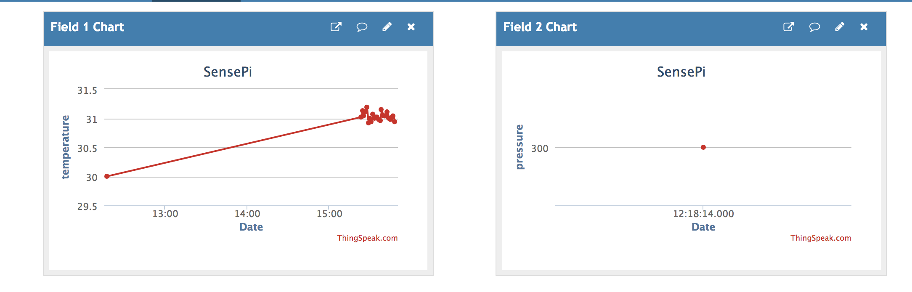
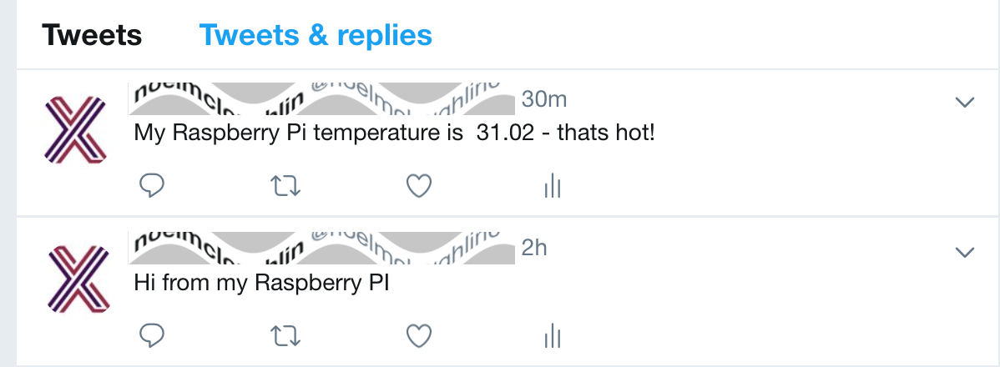

Use ThingSpeak to collect and analyize data from your devices.

Software, Hardware
===================
* Raspberry Pi2B/Pi3B
* SenseHAT
* Access tokens as OS environment variables

IoT Platform
============

https://thingspeak.com

OS setup
========

* Setup iot platform access tokens how you like. I use `~/.bash_profile` to manage as environment variables. Remember `sudo -E` for scripts needing elevated privledges.

.. code-block:: bash

    vi ~/.bash_profile
    ### My IoT Device Inventory
    export THINGSPEAK_RTOKEN_SENSEHAT="wwwwwwwwwwwwwww"
    export THINGSPEAK_WTOKEN_SENSEHAT="xxxxxxxxxxxxxxx"
    export THINGSPEAK_RTOKEN_RPI3BPLUS="yyyyyyyyyyyyyy"
    export THINGSPEAK_WTOKEN_RPI3BPLUS="zzzzzzzzzzzzzz"

    ### environment variables needed by iot-pi-stepping-stones ###
    export MY_THINGSPEAK_RTOKEN="${THINGSPEAK_RTOKEN_SENSEHAT}"
    export MY_THINGSPEAK_WTOKEN="${THINGSPEAK_WTOKEN_SENSEHAT}"

* Execute command to setup the software

.. code-block:: bash

        ./wia/configure_thingspeak.py

Publish weather data
====================
The SenseHAT has temperature, pressure, and humidity sensors suitable for a Weather station.

* Open Terminal #1 and run script to publish events to your Thingspeak channel-

.. code-block:: bash

    sudo -E ./thingspeak/sensehat.py

* Thingspeak consumes your Pi SenseHat temp/humidity/pressure data. 

* Thingspeak has integrations with various third-party services too-

